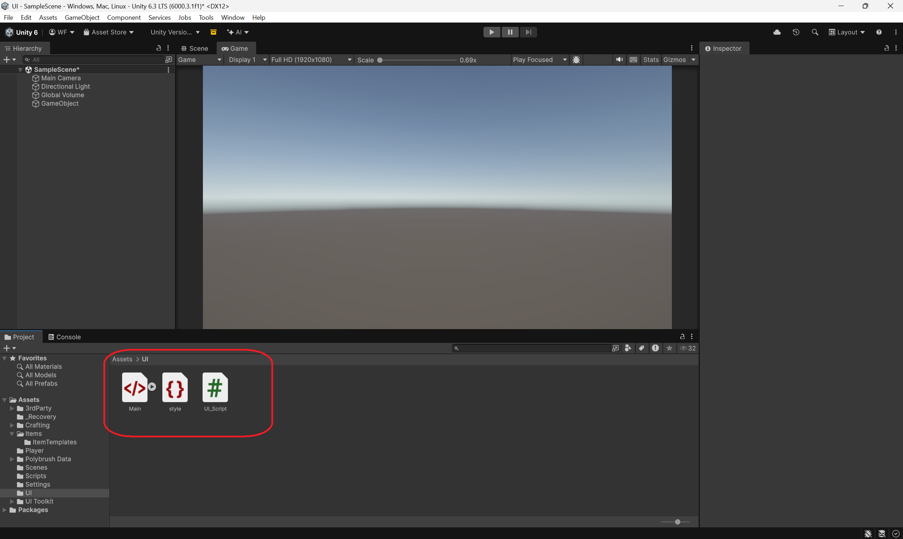
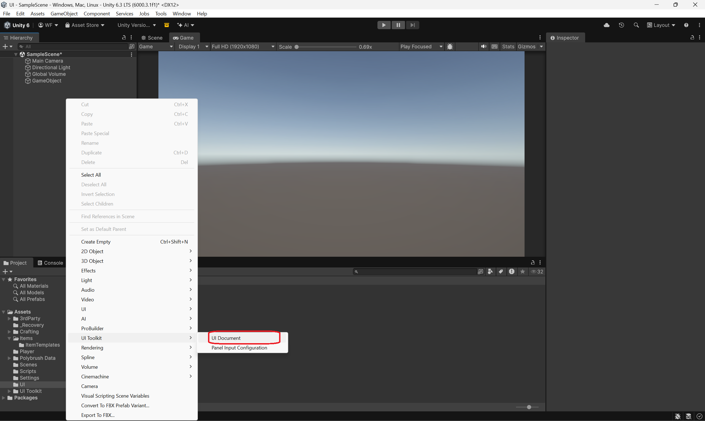
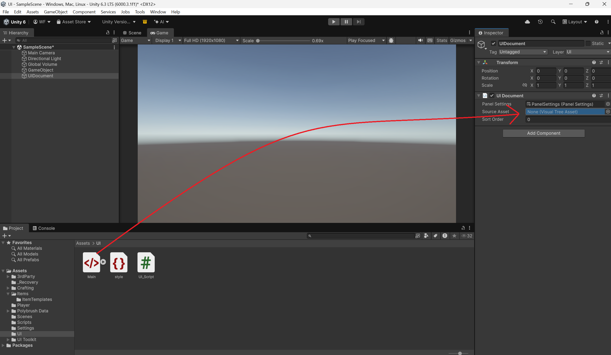
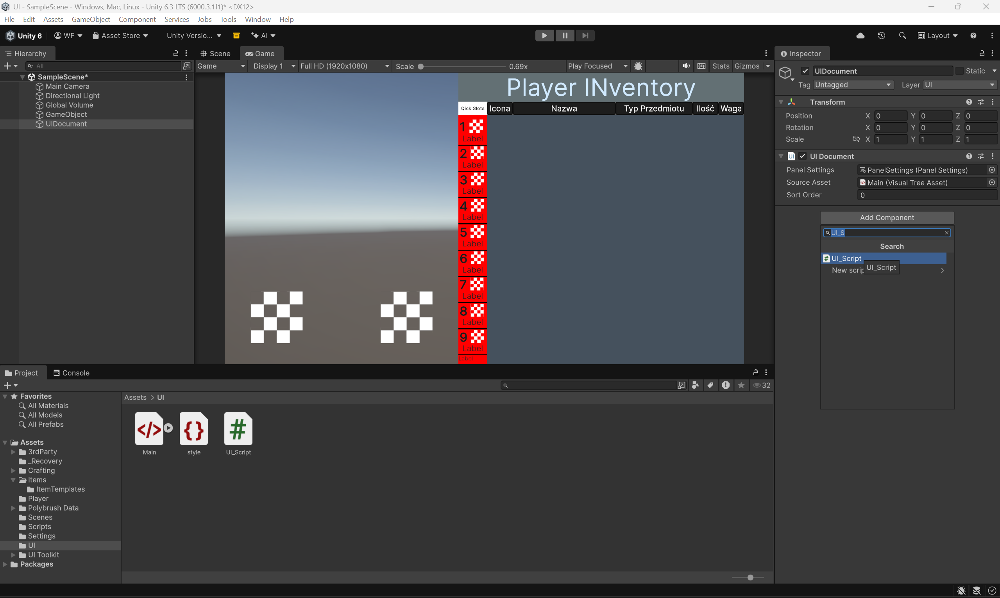
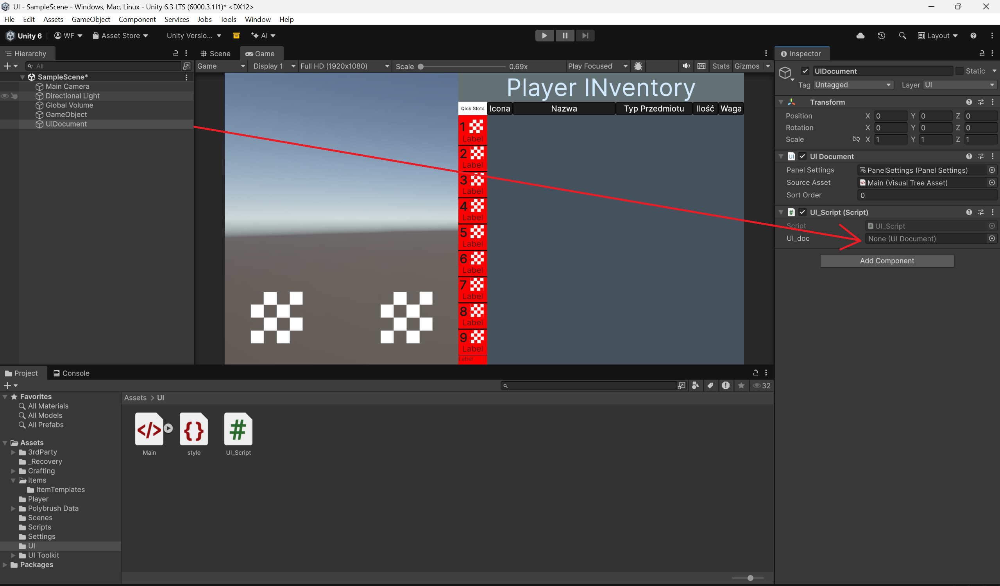

# UI Branch

Ten branch zawiera kompletny system interfejsu użytkownika oparty na **UI Toolkit**. Poniżej znajduje się instrukcja implementacji oraz dokumentacja dostępnych metod.

---

## 🛠 Instrukcja Importu (Import Guide)

Postępuj zgodnie z poniższymi krokami, aby poprawnie skonfigurować UI w swoim projekcie Unity:

1. **Pliki projektu**: Umieść pliki znajdujące się w folderze `UI` z GitHuba bezpośrednio w swoim projekcie Unity.
   

2. **UIDocument**: Utwórz na scenie nowy obiekt i dodaj do niego komponent **UIDocument** (możesz go nazwać dowolnie).
   

3. **Plik źródłowy**: Do pola *Visual Tree Asset* w komponencie UIDocument przeciągnij plik `Main.uxml`.
   

4. **Skrypt**: Do tego samego obiektu na scenie dodaj komponent **UI_Script**.
   

5. **Powiązanie**: W inspektorze skryptu `UI_Script`, do pola wymagającego UIDocument, przeciągnij ten sam obiekt, na którym pracujesz.
   

---

## 📜 Dostępne Funkcje (API)

Możesz komunikować się z interfejsem za pomocą poniższych metod publicznych:

### Zarządzanie Ekwipunkiem

| Funkcja | Opis | Przykład użycia |
| :--- | :--- | :--- |
| `SendItemList(List<Item> items)` | Przesyła listę przedmiotów do wyświetlenia w UI. | `UI_Script.Instance.SendItemList(inventory);` |
| `HideInventory()` | Minimalizuje/ukrywa interfejs ekwipunku. | `UI_Script.Instance.HideInventory();` |
| `ShowInventory()` | Wyświetla interfejs ekwipunku. | `UI_Script.Instance.ShowInventory();` |
| `RemoveItem(string name, int amount)` | Usuwa określoną ilość przedmiotu z interfejsu. | `UI_Script.Instance.RemoveItem("Apple", 1);` |

> [!WARNING]
> Funkcja `RemoveItem` w tej wersji działa poprawnie tylko wtedy, gdy przedmiot znajduje się bezpośrednio na liście `List`.

### Pobieranie Danych (Getters)

* **`GetOriginalItemFromSlot(int index)`**
    * Pobiera dane o przedmiotach w slotach szybkiego wyboru (Quick Slots).
    * Zakres indeksów: `0-8`.
    * Zwraca: obiekt typu `Item`.
* **`GetItemLeftHand()`** oraz **`GetItemRighHand()`**
    * Zwracają dane o przedmiocie trzymanym odpowiednio w lewej lub prawej ręce.
    * Zwraca: obiekt typu `Item`.

---
*Dokumentacja wygenerowana dla UI Branch - Styczeń 2026*